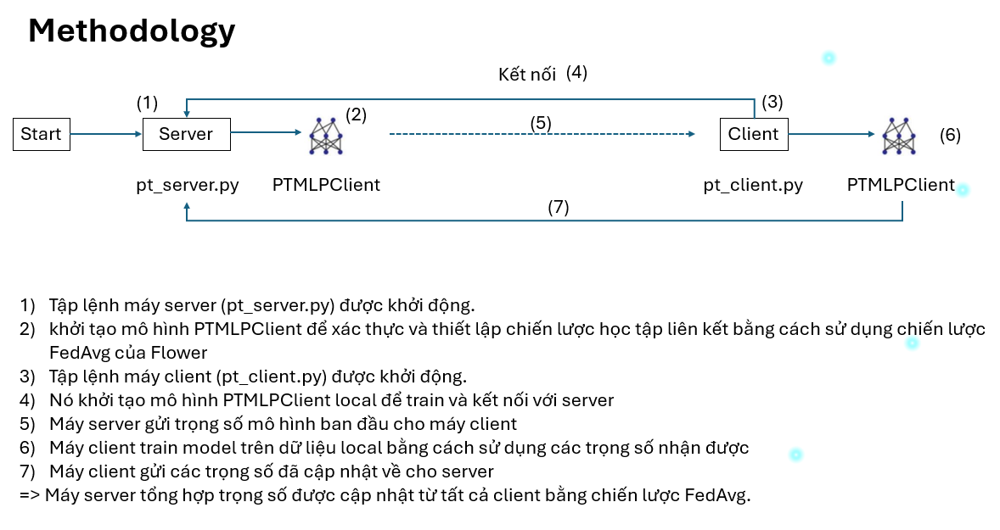

# fed-yfinance-demo

### start server
```bash
python -m pt_server -r 50
```
### Start client alice
```bash
python -m pt_client -s alice
```

### Start client alice
```bash
python -m pt_client -s bob
```
### error with linux VMS
``
On Linux, run first sudo apt update. Then the command would be: sudo apt install python3-pip
``

pip3 install scikit-learn==0.24.0

<div align="center">

</div>